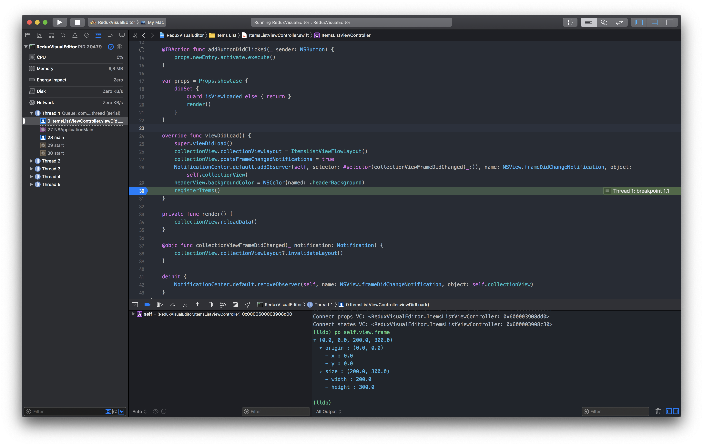
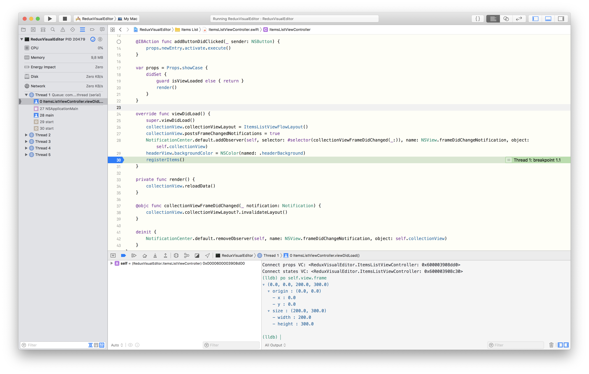

# One Dark - Xcode Color theme

Popular theme in two variations light and dark

## Setup
```sh
mkdir ~/Library/Developer/Xcode/UserData/FontAndColorThemes/
git clone https://github.com/MaximBazarov/One-Dark-Xcode.git
cp One-Dark-Xcode/themes/* ~/Library/Developer/Xcode/UserData/FontAndColorThemes/
rm -rf One-Dark-Xcode/
```

then choose `One Dark Original` `One Dark Original` color theme in your Xcode

### One Dark Original



### One Dark Original


